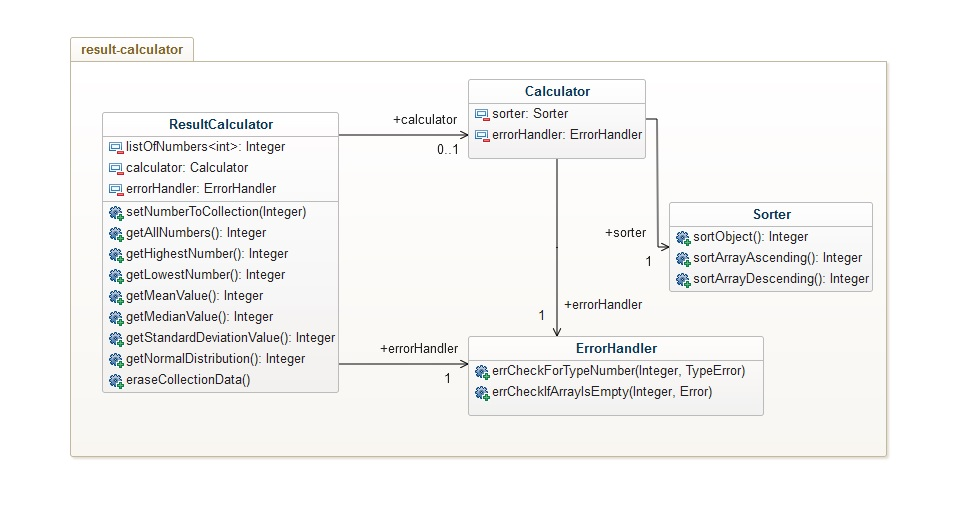

# Mall för inlämning laboration 1, 1dv610
​
## Checklista
  - [x] Jag har skrivit all kod och reflektioner själv. Jag har inte använt mig av andras kod för att lösa uppgiften.
  - [x] Mina testresultat är skrivna utifrån utförd testning ( och inte teoretiskt: "det bör fungera" :) )
  - [x] Koden är objektorienterad
  - [x] Jag har skrivit en modul som riktar sig till programmerare
​
## Egenskattning och mål
  - [ ] Jag är inte klar eftersom jag vet att jag saknar något. (Då skall du inte lämna in! Lämna då istället in på restlaboration.)
  - [x] Jag eftersträvar med denna inlämning godkänt betyg (E-D)
    - [x] De flesta testfall fungerar
    - [x] Koden är förberedd på Återanvändning
    - [x] All kod samt historik finns i git 
    - [x] Kodkvaliterskraven är ifyllda
    - [x] Reflektion är skriven utifrån bokens kapitel 
  - [x] Jag eftersträvar med denna inlämning högre betyg (C-B) och anser mig uppfylla alla extra krav för detta. 
    - [x] Samtliga testfall är skrivna    
    - [x] Testfall är automatiserade
    - [x] Det finns en tydlig beskrivning i hur modulen skall användas (i git)
    - [x] Kodkvalitetskraven är varierade 
  - [ ] Jag eftersträvar med denna inlämning högsta betyg (A) 
​
Förtydligande: Examinator kommer sätta betyg oberoende på vad ni anser. 
​
## Återanvändning

I [README.md](./result-calculator/README.md) finns beskrivet hur en användare kan använda modulen, dessutom finns ytterligare beskrivning hur man går tillväga om man vill utgå från modulen för att utöka modulen med egen kod.

Dokumentet finns även på [npm](https://www.npmjs.com/package/result-calculator).
​
## Beskrivning av min kod

Koden är uppbyggd på så sätt att klassen ResultCalculator är det öppna interfacet. Det är det enda som användaren kommer åt, och det enda man kan komma åt är metoderna som visas i klassdiagrammet. Metoderna i sig gör ingen logik, och användaren kan inte på något sätt förändra affärslogiken. Den här klassen håller också en lista av nummer som man bara kan förändra genom att skicka in data av typen `number`, eller anropa metoden `eraseCollectionData()`(Det är endast i de här två metoderna användaren kan göra något annat än att läsa data.). Det som händer när man anropar t.ex `getMeanValue()`, är att ett metodanrop till Calculator görs, och det är väl där inne som uträkningarna sker, skyddade från användarens inblandning.

​
## Hur jag testat
Dels har jag haft en testdriven utveckling, där jag har försökt skriva enhetstester som jag utvecklar efter. Dels har jag använt mig av en example-app för att testa modulen i en mer realistisk miljö, både genom att använda modulen internt, men i slutskedet också genom att använda mig av npm-paketet.
​
### Testfall

Testrapport hittas i [testrapport.md](./testrapport.md)
​
​
## Kodkvalitetskrav och Laborationsreflektion
​
Kodkvalitetskrav och reflektion hittas i [reflektion.md](./reflektion.md).

Här reklekteras dels kodkvalitetskrav, och en mer övergripande laborationsreflektion.
​
