# Testrapport

### Översikt

Den här modulen har enbart testats med automatiska enhetstester, och testerna har drivit utvecklingen (TDD). Till min hjälp har jag använt Jest som testramverk. Det finns inga issues kopplade till testerna. För att själv köra testerna behöver du navigera till katalogen `/result-calculator/`. I terminalen skriver du sedan `npm install`, för att lokalt installera paketet. När det är färdigt skrivs `npm run test` i terminalen, för att köra testerna. Vill du få en sammanställning av coverage så skriver du `npm run test:coverage` istället.

| Test suite | Amount of tests | Status |
| --- | :---: | --- |
| ResultCalculator | 10 | ✅ |
| Calculator | 19 | ✅ |
| ErrorHandler | 7 | ✅ |
| Sorter | 2 | ✅ |

---

>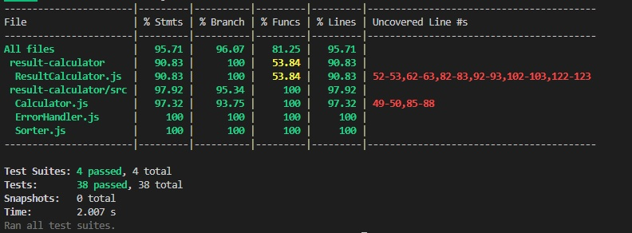

# Test suites

Här nedan ges en detaljerad beskrivning av testsuiterna, och de sub-suiter som finns. En kort beskrivning av syftet för varje suite finns tillsammans med en bild för hur testet genomförs, och vilken data som skickas in och förväntas tillbaka. Klicka på varje suite för att expandera vyn.

## ResultCalculator

### `"Add data to collection"`
Här testas möjligheten att lägga till ett nummer till listan. Det stora fokuset ligger på att man bara ska kunna lägga till datatypen "number".

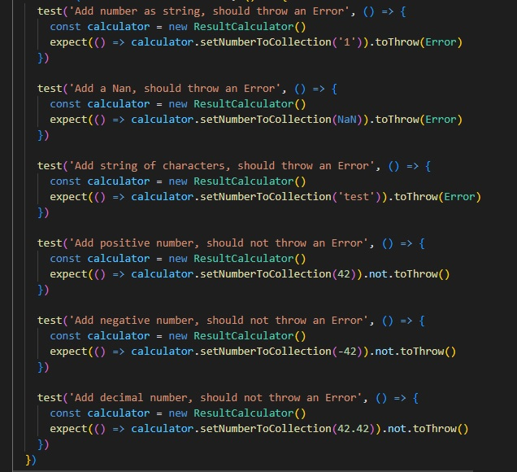

### `"Read calculated data"`
Även om själva uträkningarna testas i suiten Calculator, så behöver det finnas en del tester som kontrollerar att uträkningarna sker på rätt sätt ihop med samlingen av nummer som hålls av klassen "ResultCalculator", som är den datan som skickas ut till användaren.

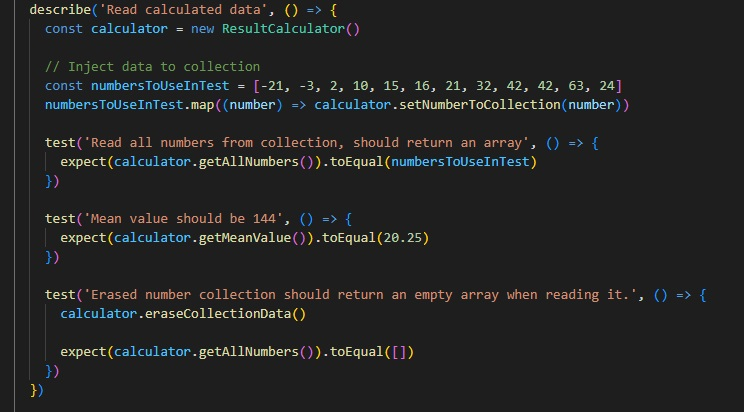

### `"Read normal distribution"`
Här testas beteendet i ett tänkt användningsfall, för att kontrollera att de nummer man lägger in i samlingen räknas ut på rätt sätt. 

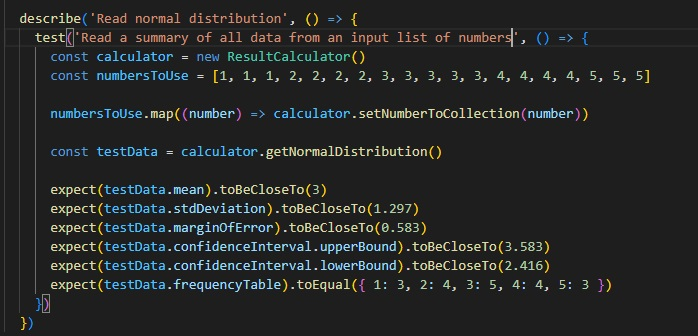

## Calculator

### `"Calculate descriptive statistics"`
I den här sub-suiten testas metoderna som gör själva uträkningarna i modulen. 

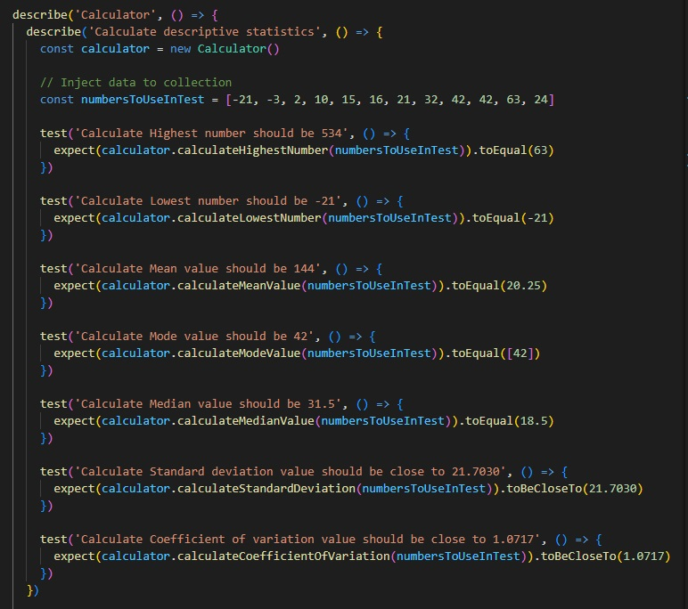

### `"Calculate with invalid data"`
Den här sub-suiten testar metoderna med felaktig input.

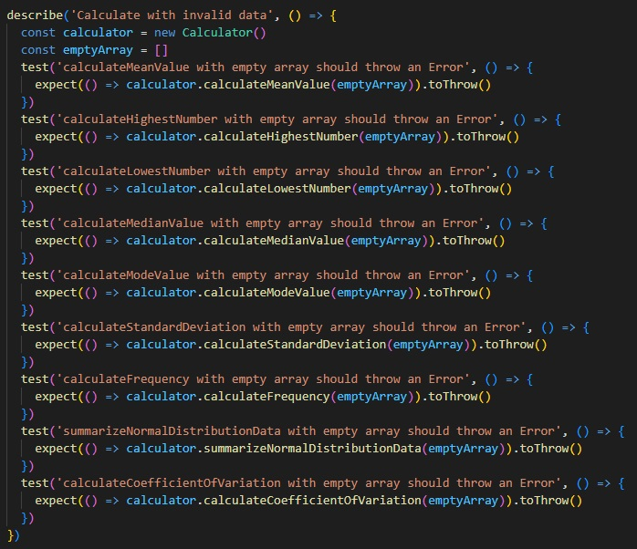

### `"Calculate a normal distribution data with decimal input"`
Här testas att ett förväntat objekt med data kan skapas även med decimala tal.

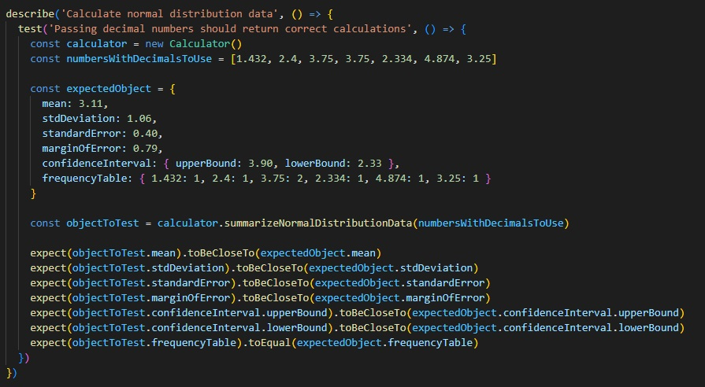

### `"Calculate frequency"`
Här testas att en frekvenstabell kan skapas både med decimala tal, och heltal.

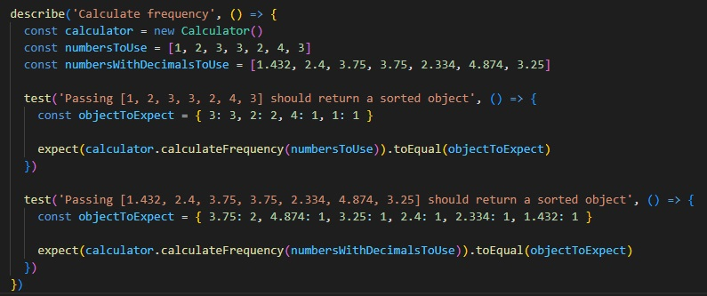

## ErrorHandler

### `"Error check number"`

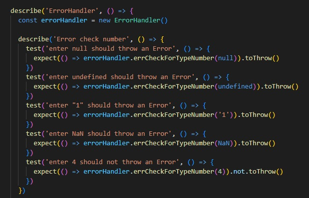

### `"Error check empty array"`

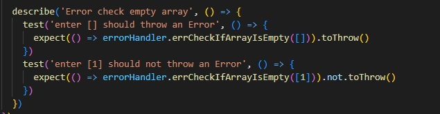

## Sorter

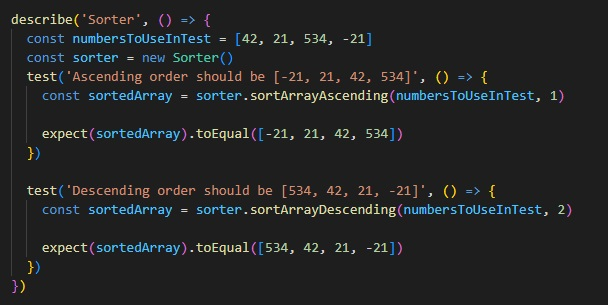

